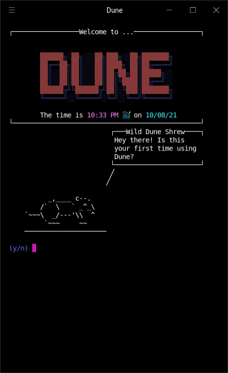
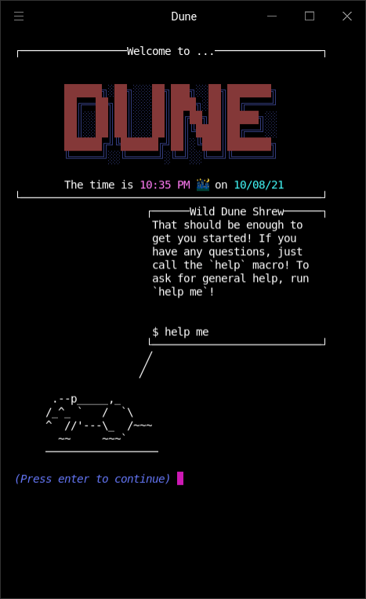
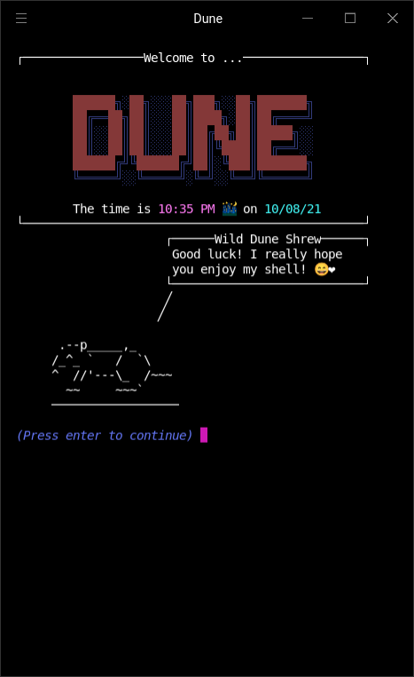

+++
title = 'About'
date = 2024-09-11T01:55:25-04:00
author = "Adam McDaniel"
+++

# Why Dune?

I feel that bash is great in a lot of ways, but it doesn't exactly feel cozy: it's lacking a sort of personal touch, and it's also missing quick and easy customizability. With my last shell, [Atom](https://github.com/adam-mcdaniel/atom), I had accomplished some of the coziness that bash was missing, but I also introduced a lot of really fatal flaws in the syntax and the type system.

Dune, however, is designed completely differently from Atom (although you might notice the similarities in their widget systems). The interpreter itself is standalone, and it holds almost none of the functionality you see in the default distribution of Dune. If you wanted to, you could write a custom frontend and make a unique Dune based shell of your own!

This frontend implementation turns the coziness dial to 11. Just check out the shell's default startup script!

<!-- 

  
  
  

 -->



I put a lot of work into making Dune just fun to use. It's like a neat little operating system itself!

Dune also attempts to be a usable scripting language, and even offers a few niche metaprogramming features such as quoting (borrowed from Lisp), operator overloading, and macros!

Overall, I wrote Dune to have a complete shell of my own: one that's fast, useful, and pretty. I'm really excited to see what people do with it.

# How do I get started?

You can download and install the latest release of Dune using the instructions in the [Install](/posts/install) section of the documentation. If you're interested in contributing to the project, you can check out the [GitHub repository](https://github.com/adam-mcdaniel/dune) and open an issue or pull request.

